# Sourcing Sound
## Audio classification

### Project Description and Motivation
- Identify sound from many possible sources (speech, animals, vehicles, ambient noise, etc.)
- Wide variety of applications for audio recognition:
    - Manufacturing quality control
    - Domestic animal monitoring
    - Wildlife monitoring
    - Security event detection
    - Music production
- Initially develop pipeline for single class
- Expand to multi-class

## Datasets
- [Freesound Dataset](https://annotator.freesound.org/fsd/) - manually labeled by open source
    - 4969 clips
    - 70 examples per class
    - Total duration: ~ 10 hours
- Portion of [Yahoo Flickr Creative Commons (YFCC) 100M dataset](https://code.flickr.net/2014/10/15/the-ins-and-outs-of-the-yahoo-flickr-100-million-creative-commons-dataset/) - 
    - 19,815 clips
    - 300 examples per class
    - Total duration: ~80 hours

## Processing
- Explored various metrics: Spectral centroid, spectral bandwidth, Spectral rolloff, zero crossing rate, MFCCs, Mel Spectrograms
- Because this project is not soley focused on human speech, Mel spectrograms are likely more appropriate. However, MFCCS were also explored, as well as raw audio, however they did not achieve the best results and generally required more computational resources.

Mel spectrograms give us an 'image' of a sound. On the Mel scale, distance between frequencies better relate to human hearing; the difference between 100 - 200hz is extremely noticeable to humans, but 10,000-10,100hz is barely audible. The Mel scale transforms audio with quasi-logarithmic frequency scaling.

### Audio feature extraction process 

The original audio:
Simply amplitude in dB over time

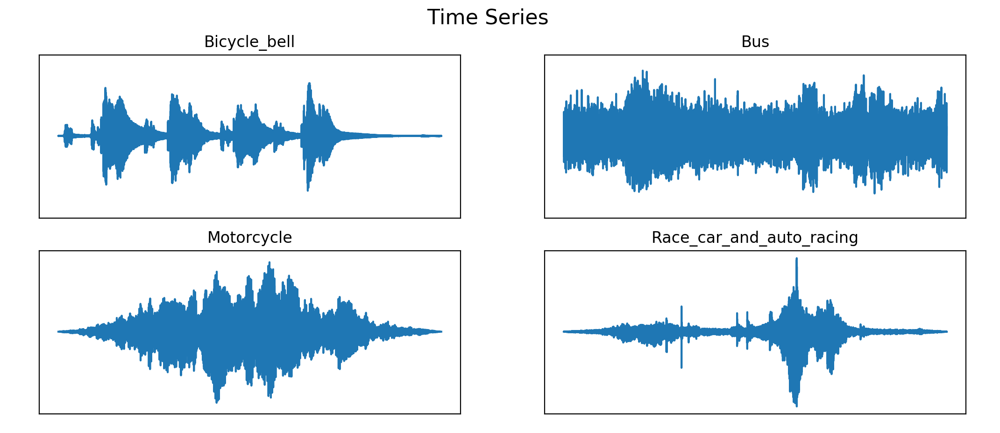

Fast Fourier Transform makes it possible to vizualize frequency concentrations for an entire clip.
X-axis is hz, Y-axis is dB. Note the lack of time scale.

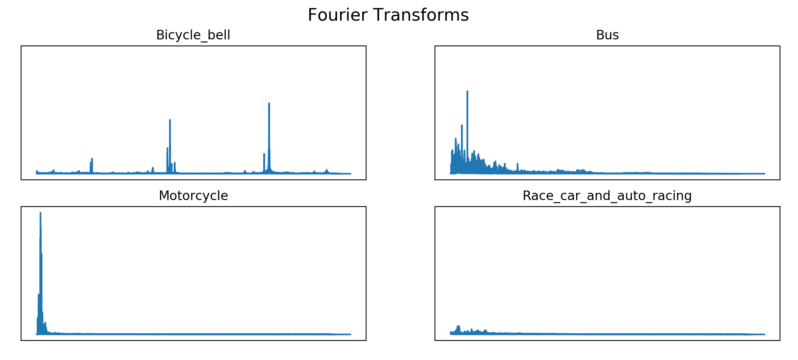

Filterbank Coefficients fall along the natural hz scale, not scaled to human hearing yet.

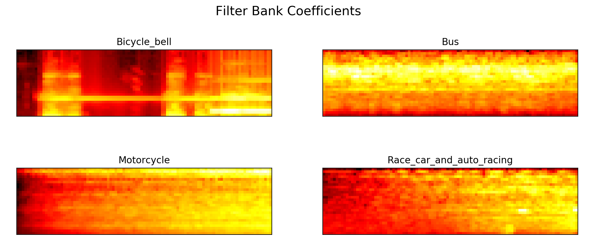

Mel Spectrograms relate the relative power of frequencies as heard by humans over a time scale.

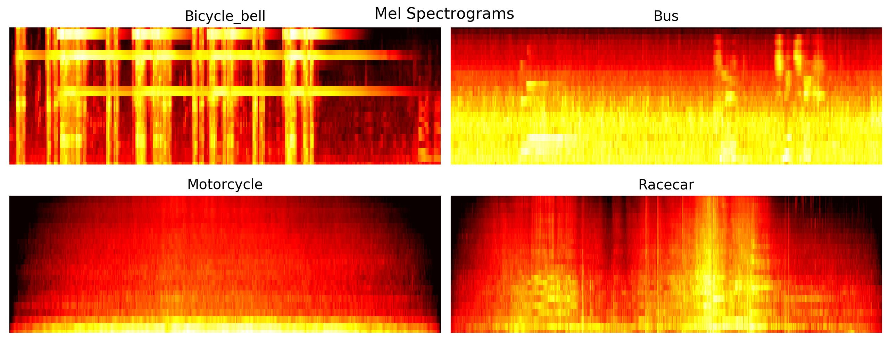

<!-- 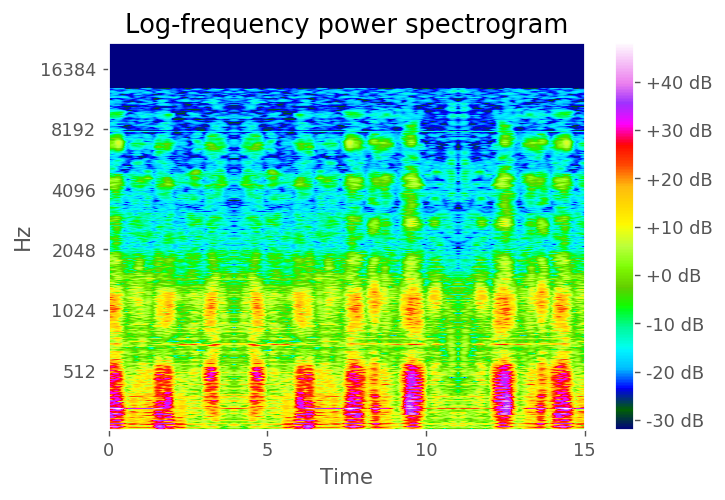
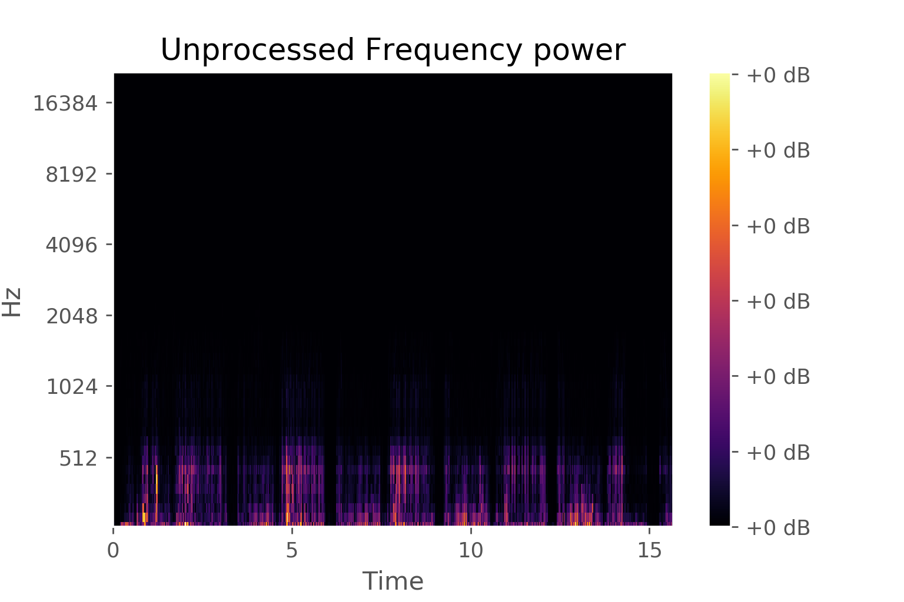
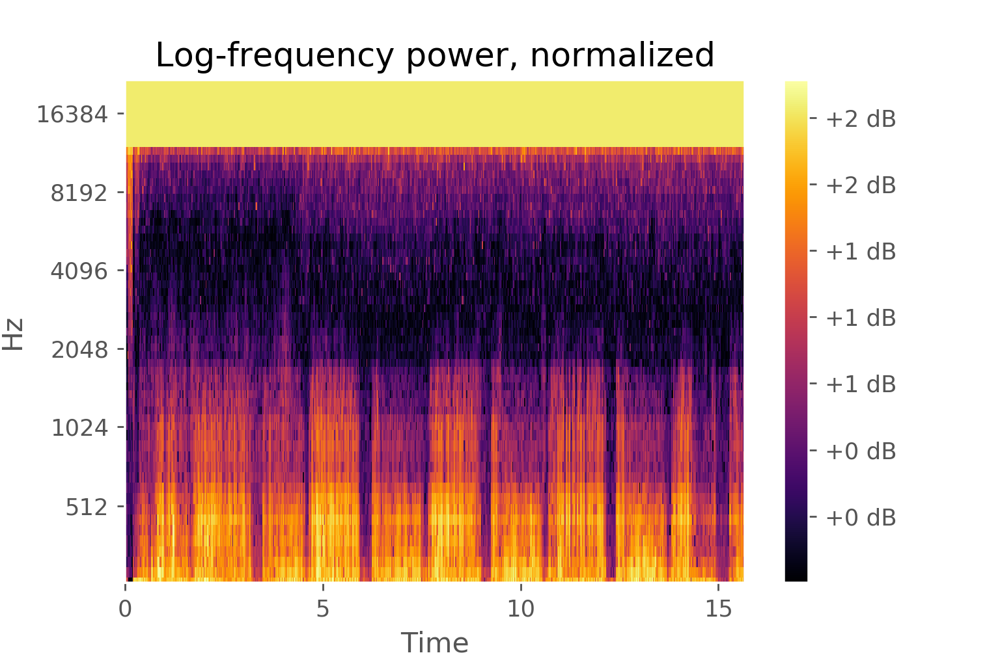 -->

## Baseline Model with classic machine learning

Initially, the class labels were reduced to a simple recognition problem: does a clip contain the sound "purr" or not?

A gradient boosting classifier was built, and trained on 3/4 of the training files, and when evaluated with the hold out set, achieved an  an accuracy of 98% and recall and precision of 0%. Even after grid searching over parameters including tree-depth, learning rate, number of estimators, the results 

The extremely low true positive rate was likely due to the model mostly being provided with "non-purr" samples, which allowed it to increase it's accuracy by simply predicting a sample was not a purr.

Other issues were probably coming from noisy data/labels, and differing sample durations.

## Initial Improvements
### Overlapping windows

To give the classifier more contextual information on the same clip, implement rolling, overlapping windows on the Mel spectrograms of the sound.

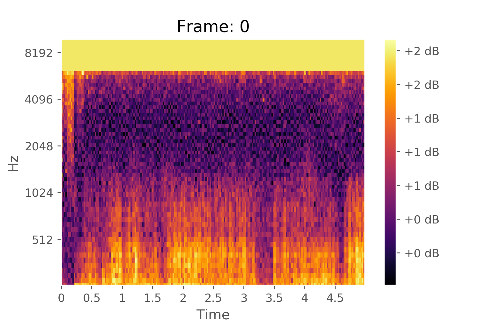
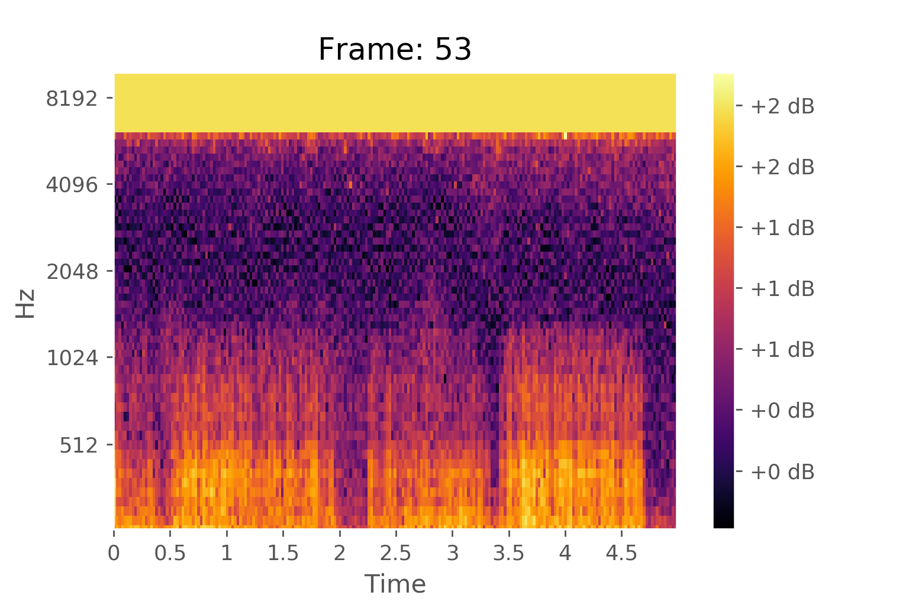
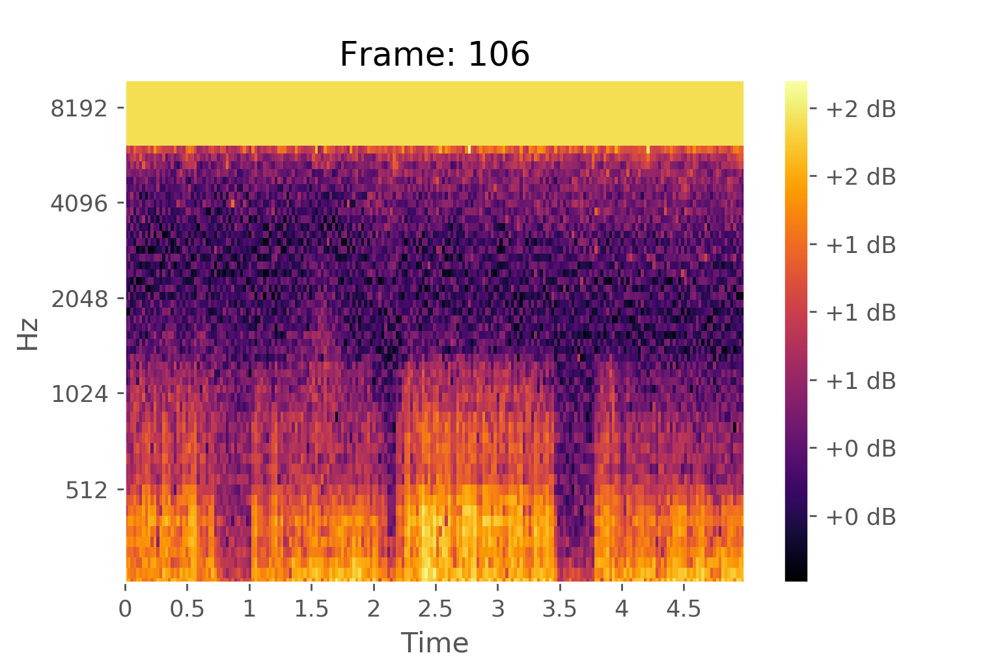
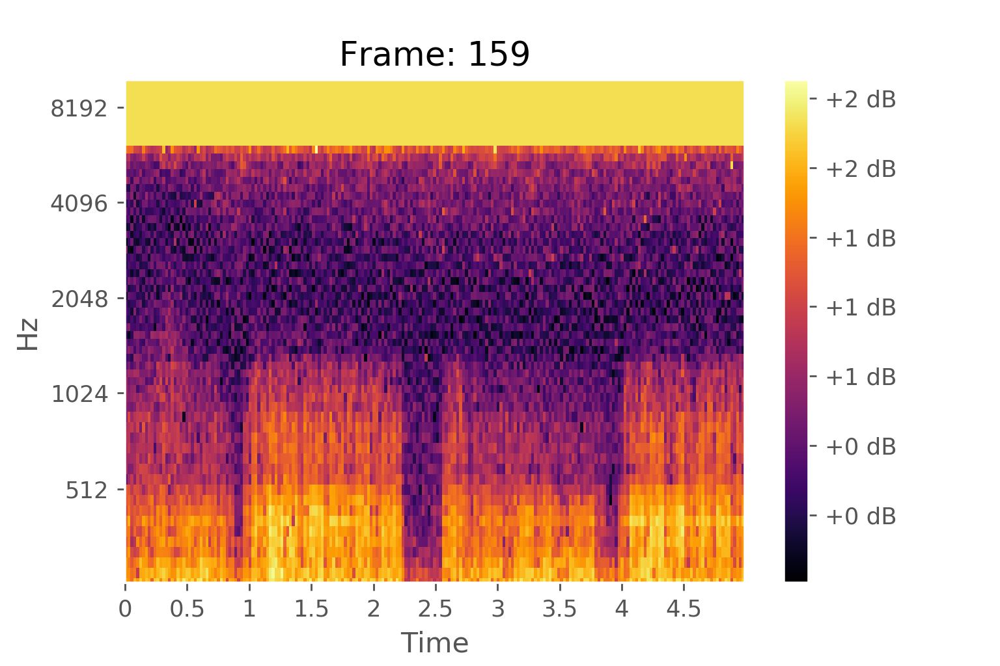

<b>Minor success:</b> Predicting on a validation set, precision increased to 52%. Recall increased to 6.6%. Accuracy dropped to 51.7%.

<b>Checkpoint, next steps:</b> Gradient boosting classifiers are a weak approach to this problem. The multiple frequency bins for every time frame are flattened end to end, thus destroying the shape of the spectrograms. Using modern image classification techniques, teaching a neural network to recognize sounds within a noisy 2D context may yield better results. It may also be more effective at solving the multiclass problem.

# Building a CNN Model

## Closer look at the data

Before taking all 70+ classes into account, it's beneficial to focus on a few classes that share a similar environment. This project focused initially on clips from the FSD with labels that were traffic/city-related. The average clip length per class can be seen below.

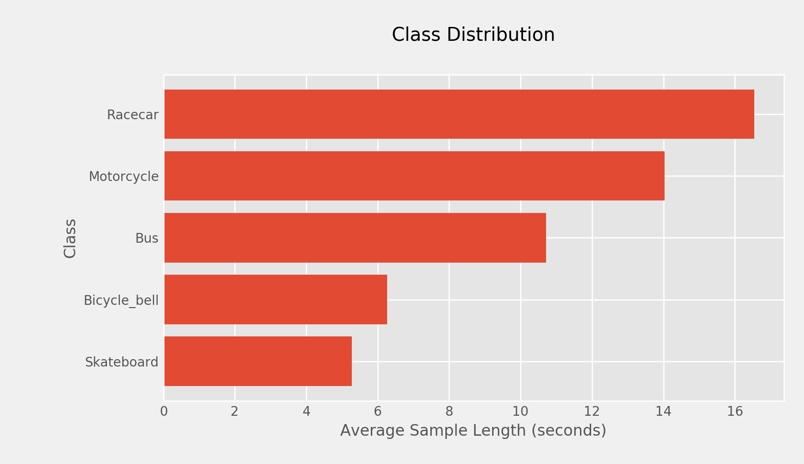

It is still necessary to handle these differing clip lengths in the data as we feed them to the CNN. An overview of a few mel spectrograms of each class shows the variety and similarity possible within a class.

Some samples have remarkable similarity. See 'Bus', for example. It was necessary to manually listen to these files to ensure they were not actually duplicates. They are not duplicates, rather the samples were recorded on the same bus or bus system, and an announcement chime is present at similar points in the audio files, resulting in the characteristic smears. In the similarly appearing bicycle bell spectrograms, upon listening, it sounds like the same bell was recorded multiple times, resulting in near identical features, however there are clear, audible differences. 

The obvious danger created by these similar examples is that some of their signatures may not be considered actual signatures of the class, rather the sonic signature of the environment where they were recorded. At this point, bringing in another dataset with cleaner audio for the model to train on seemed to be an inevitable direction, but a first attempt was made on existing data. 

## Initial Model

A relatively simply CNN model was compiled in Python using Tensorflow with Keras. Each clip was downsampled to a sample rate of 16,000 samples per second, with a bit depth of 16 (2 to the 16 possible values per sample). The audio was converted to mel spectrograms with 60 filters. To increase examples of each class,  these spectrograms were repeatedly randomly sliced which created a uniform shape of inputs for the model.

After training for 100 epochs, the model's validation accuracy was not increasing anymore. On a hold-out set, the best model recorded about 53% accuracy.

### New data, different approach

Gathered new data: [UrbanSound8K Dataset](https://urbansounddataset.weebly.com/urbansound8k.html)
- 8732 labeled sound excerpts(<=4s>)
- 10 classes of urban sounds:
    - Air conditioner
    - Car horn
    - Children playing
    - Dog bark
    - Drilling
    - Engine idling
    - Gun shot
    - Jackhammer
    - Siren
    - Stree music

Other projects <link> have used MFCCs to train models, and that was explored initially on this dataset. Mel spectrograms will be explored as well with a similar CNN framework. 

#### MFCCS:

Training for 72 epochs, with batch size 256:

    Training completed in time:  0:07:46.033253
    Training Accuracy:  0.9099499
    Testing Accuracy:  0.8666285

Training for 500 epochs, batch size 256:

    Training completed in time:  0:53:06.691380
    Training Accuracy:  0.9975662
    Testing Accuracy:  0.9364625

10 fold cross validation. 100 training epochs. 256 Batch Size

    Training completed in time:  1:17:56.257562
    Fold 1:    accuracy = 0.5899198055267334
    Fold 2:    accuracy = 0.5777027010917664
    Fold 3:    accuracy = 0.5502702593803406
    Fold 4:    accuracy = 0.6030303239822388
    Fold 5:    accuracy = 0.6559829115867615
    Fold 6:    accuracy = 0.6184689998626709
    Fold 7:    accuracy = 0.6288782954216003
    Fold 8:    accuracy = 0.6240694522857666
    Fold 9:    accuracy = 0.6678921580314636
    Fold 10:    accuracy = 0.6702508926391602
    Average Accuracy:  0.61864656

<!-- ## RNN Model -->