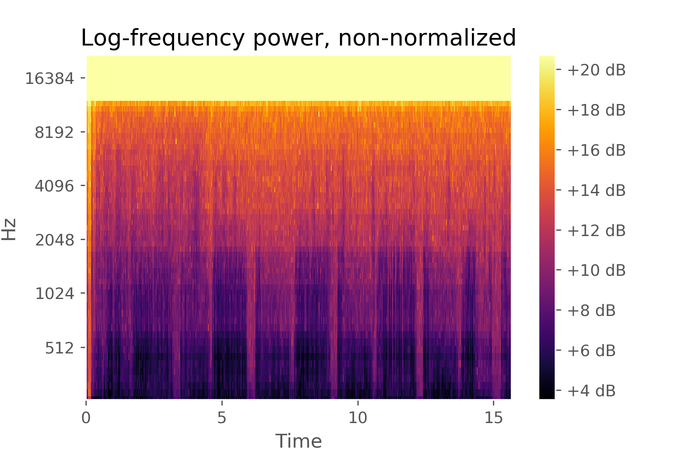
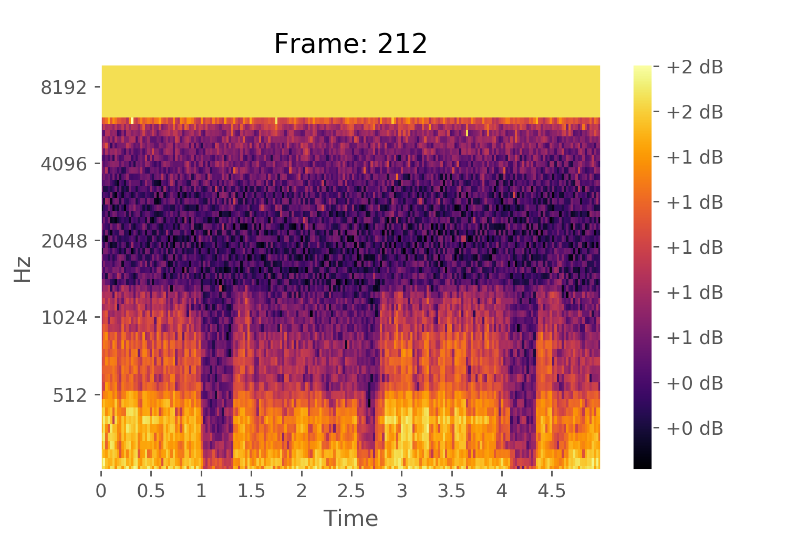
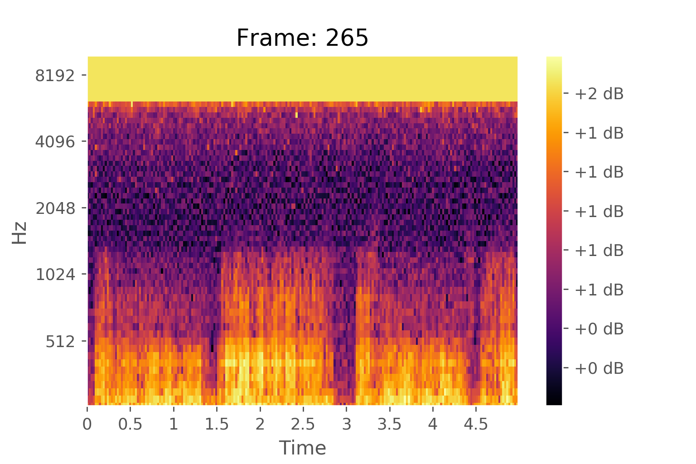

# Sourcing Sound
## Audio classification

### Project Description and Motivation
- Identify sound from many possible sources (speech, animals, vehicles, ambient noise, etc.)
- Wide variety of applications for audio recognition:
    - Manufacturing quality control
    - Domestic animal monitoring
    - Wildlife monitoring
    - Security event detection
    - Music production
- This project intends to provide proof of concept by narrowing on a single sound, a cat’s purr.

## Dataset
- Freesound Dataset - annotated by open source
- 4969 training samples
- 4481 test samples
- 79 classes, 70 examples per class (in training set)
- Explored various metrics: Spectral centroid, spectral bandwidth, Spectral rolloff, zero crossing rate, MFCCs, Mel Spectrograms

## Baseline Model

A Gradient Boosting Classifier model was trained on 3/4 of the training files, and when evaluated with the hold out set, achieved an  an accuracy of 98% and recall and precision of 0%. The extremely low true positive rate was likely due to the model mostly being provided with "non-purr" samples, which allowed it to increase it's accuracy by simply predicting a sample was not a purr.

Other issues were probably coming from noisy data, and differing sample durations.

## Improvements

### Overlapping windows

To give classifier more perspectives on the same sound, implement rolling, overlapping windows on the Mel spectrograms of the sound.

