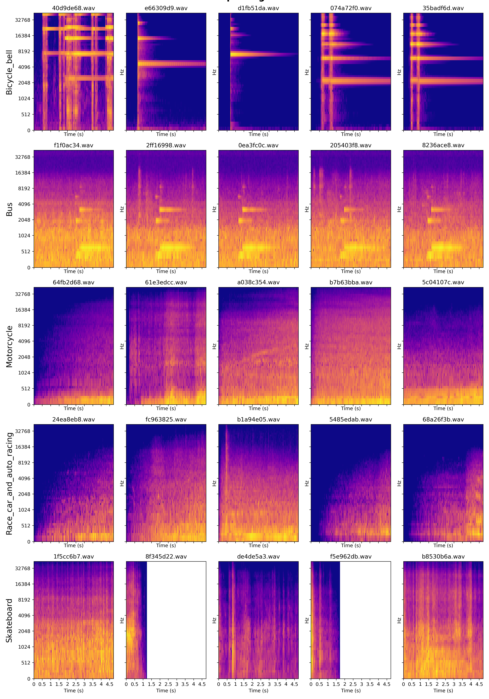
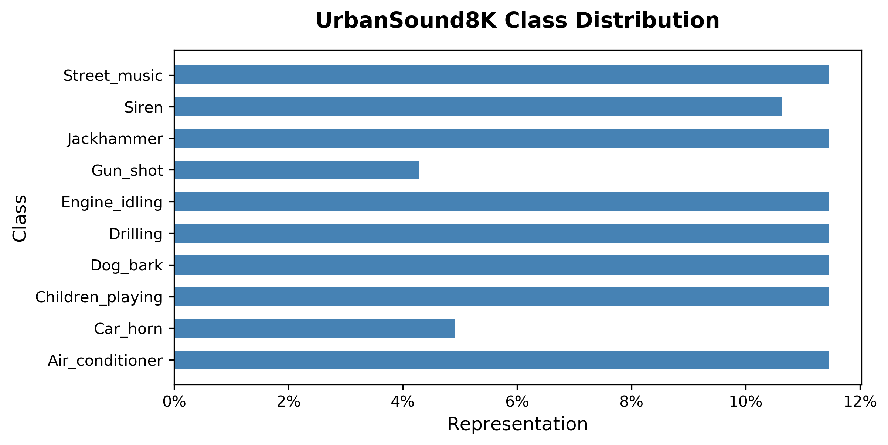
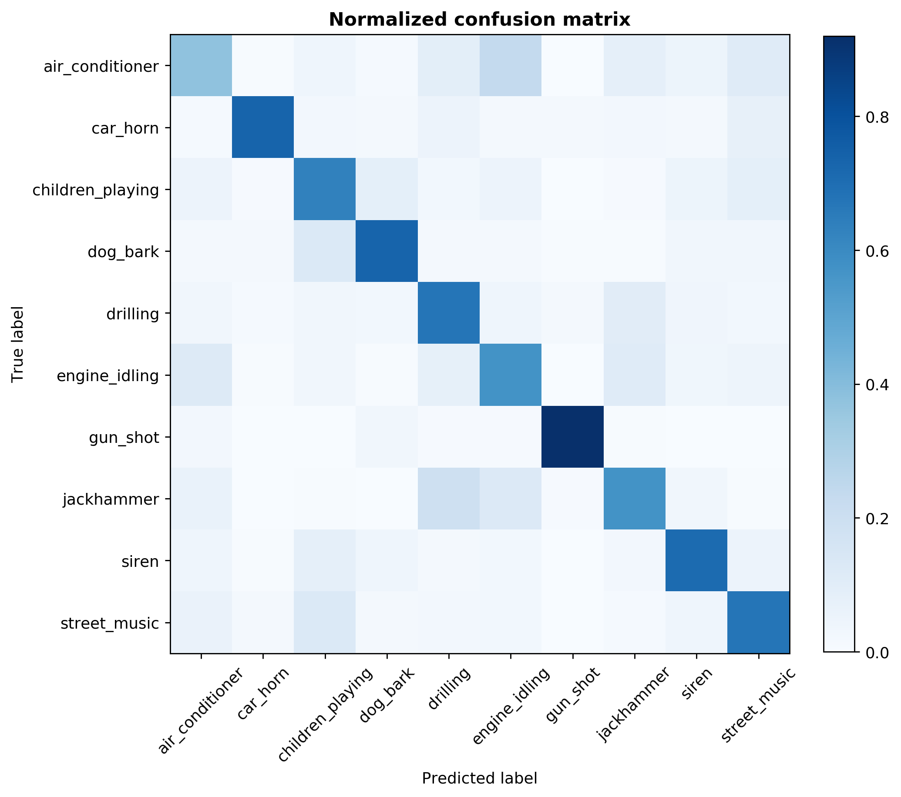

# Sourcing Sound
## Audio classification with ML

### Project Description and Motivation
- Identify sound from many possible sources (speech, animals, vehicles, ambient noise, etc.)
- Wide variety of applications for audio recognition:
    - Manufacturing quality control
    - Domestic animal monitoring
    - Wildlife monitoring
    - Security event detection
    - Music production
- Create deployable webapp for sound recognition, with model running on backend.

## Datasets
- [Freesound Dataset](https://annotator.freesound.org/fsd/) - manually labeled by open source
    - 4969 clips
    - 70 examples per class (79 classes)
    - Total duration: ~ 10 hours
- Portion of [Yahoo Flickr Creative Commons (YFCC) 100M dataset](https://code.flickr.net/2014/10/15/the-ins-and-outs-of-the-yahoo-flickr-100-million-creative-commons-dataset/) 
    - 19,815 clips
    - 300 examples per class (79 classes)
    - Total duration: ~80 hours
- UrbanSound8k
     - 8732 clips
     - 400 - 100 examples per class (10 classes)

## Processing
- Explored various metrics: Spectral centroid, spectral bandwidth, Spectral rolloff, zero crossing rate, MFCCs, Mel Spectrograms
- Because this project is not soley focused on human speech, Mel spectrograms are likely more appropriate. However, MFCCS were also explored, as well as raw audio, however they did not achieve the best results and generally required more computational resources.

Mel spectrograms give us an 'image' of a sound. On the Mel scale, distance between frequencies better relate to human hearing; the difference between 100 - 200hz is extremely noticeable to humans, but 10,000-10,100hz is barely audible. The Mel scale transforms audio with quasi-logarithmic frequency scaling.

### Audio feature extraction process 

The original audio:
Simply amplitude in dB over time

Fast Fourier Transform makes it possible to vizualize frequency concentrations for an entire clip.
X-axis is hz, Y-axis is dB. 

Filterbank Coefficients fall along the natural hz scale, not scaled to human hearing yet.

Mel Spectrograms relate the relative power of frequencies as heard by humans over a time scale.

<!-- 

 -->

## Baseline Model with classic machine learning

Initially, the class labels were reduced to a simple recognition problem: does a clip contain the sound "purr" or not?

A gradient boosting classifier was built, and trained on 3/4 of the training files, and when evaluated with the hold out set, achieved an  an accuracy of 98% and recall and precision of 0%. Even after grid searching over parameters including tree-depth, learning rate, number of estimators, the results 

The extremely low true positive rate was likely due to the model mostly being provided with "non-purr" samples, which allowed it to increase it's accuracy by simply predicting a sample was not a purr.

Other issues were probably coming from noisy data/labels, and differing sample durations.

## Initial Improvements
### Overlapping windows

To give the classifier more contextual information on the same clip, implement rolling, overlapping windows on the Mel spectrograms of the sound.

<b>Minor success:</b> Predicting on a validation set, precision increased to 52%. Recall increased to 6.6%. Accuracy dropped to 51.7%.

<b>Checkpoint, next steps:</b> Gradient boosting classifiers are a weak approach to this problem. The multiple frequency bins for every time frame are flattened end to end, thus destroying the shape of the spectrograms. Using modern image classification techniques, teaching a neural network to recognize sounds within a noisy 2D context may yield better results. It may also be more effective at solving the multiclass problem.

# Building a CNN Model

## Closer look at the data

Before taking all 70+ classes into account, it's beneficial to focus on a few classes that share a similar environment. This project focused initially on clips from the FSD with labels that were traffic/city-related. The average clip length per class can be seen below.

It is still necessary to handle these differing clip lengths in the data as we feed them to the CNN. An overview of a few Mel spectrograms of each class shows the variety and similarity possible within a class.

Some samples have remarkable similarity. See 'Bus', for example. It was necessary to manually listen to these files to ensure they were not actually duplicates. They are not duplicates, rather the samples were recorded on the same bus or bus system, and an announcement chime is present at similar points in the audio files, resulting in the characteristic smears. In the similarly appearing bicycle bell spectrograms, upon listening, it sounds like the same bell was recorded multiple times, resulting in near identical features, however there are clear, audible differences. 

The obvious danger created by these similar examples is that some of their signatures may not be considered actual signatures of the class, rather the sonic signature of the environment where they were recorded. At this point, bringing in another dataset with cleaner audio for the model to train on seemed to be an inevitable direction, but a first attempt was made on existing data. 

## Initial Model

A relatively simply CNN model was compiled in Python using Tensorflow with Keras. Each clip was downsampled to a sample rate of 16,000 samples per second, with a bit depth of 16 (2 to the 16 possible values per sample). The audio was converted to Mel spectrograms with 60 filters. To increase examples of each class, these spectrograms were repeatedly randomly sliced which created a uniform shape of inputs for the model.

After training for 100 epochs, the model's validation accuracy was not increasing anymore. On a hold-out set, the best model recorded about 53% accuracy.

### New data, different approach

Gathered new data: [UrbanSound8K Dataset](https://urbansounddataset.weebly.com/urbansound8k.html)
- 8732 labeled sound excerpts(<=4s>)
- 10 classes of urban sounds:
    - Air conditioner
    - Car horn
    - Children playing
    - Dog bark
    - Drilling
    - Engine idling
    - Gun shot
    - Jackhammer
    - Siren
    - Stree music

[Other projects](http://www.justinsalamon.com/uploads/4/3/9/4/4394963/salamon_urbansound_acmmm14.pdf) have used MFCCs to train models, and that was explored initially on this dataset. Mel spectrograms will be explored as well with a similar CNN framework. 

#### \*\*\*A note on cross-validation***
Due to the way the UrbanSound8K dataset was created, model results will be invalid if you reshuffle the data and create your own train-test split. Some sounds come from very similar acoustic environments or even the same wav file, and a model will easily recognize this in testing if you shuffle the data, because it will easily see the same noise signature, but not necessarily the true class/signal signature.
Use the 10 predefined folds for testing a model to validate its ability to make classifications in unseen environments

<!-- Training for 72 epochs, with batch size 256:

    Training completed in time:  0:07:46.033253
    Training Accuracy:  0.9099499
    Testing Accuracy:  0.8666285 -->
For example, by shuffling the data (commonly seen online) these results were obtained:

    500 training epochs, batch size=256:
    Feature type: 'mfccs'
    Training completed in time:  0:53:06.691380
    Training Accuracy:  0.9975662
    Testing Accuracy:  0.9364625

However, with the 10 fold cross validation:

    100 training epochs,  batch Size=256:
    Feature type: 'mfccs'
    Training completed in time:  1:17:56.257562
    Fold 1:    accuracy = 0.5899198055267334
    Fold 2:    accuracy = 0.5777027010917664
    Fold 3:    accuracy = 0.5502702593803406
    Fold 4:    accuracy = 0.6030303239822388
    Fold 5:    accuracy = 0.6559829115867615
    Fold 6:    accuracy = 0.6184689998626709
    Fold 7:    accuracy = 0.6288782954216003
    Fold 8:    accuracy = 0.6240694522857666
    Fold 9:    accuracy = 0.6678921580314636
    Fold 10:    accuracy = 0.6702508926391602
    Average Accuracy:  0.61864656

# Models

- A number of different neural configurations were explored, including CNNs and RNNs.
- CNNs outperformed RNN and took less time for training.
- Primary metrics to measure model performance: Validation accuracy, class recall/precision/f-1 score.
- Best model had 3 convolutional layers, 4 fully connected layers. 
- L2 weight regularization in convolutial improved performance.
- Because the sounds are not limited to speech, Mel spectrogram featurization provided better results than MFCC featurization.

### Results

    Model: "sequential"
    _________________________________________________________________
    Layer (type)                 Output Shape              Param #   
    =================================================================
    conv2d (Conv2D)              (None, 59, 173, 16)       80        
    _________________________________________________________________
    max_pooling2d (MaxPooling2D) (None, 29, 86, 16)        0         
    _________________________________________________________________
    conv2d_1 (Conv2D)            (None, 28, 85, 32)        2080      
    _________________________________________________________________
    dropout (Dropout)            (None, 28, 85, 32)        0         
    _________________________________________________________________
    conv2d_2 (Conv2D)            (None, 26, 83, 64)        18496     
    _________________________________________________________________
    max_pooling2d_1 (MaxPooling2 (None, 13, 41, 64)        0         
    _________________________________________________________________
    dropout_1 (Dropout)          (None, 13, 41, 64)        0         
    _________________________________________________________________
    flatten (Flatten)            (None, 34112)             0         
    _________________________________________________________________
    dense (Dense)                (None, 64)                2183232   
    _________________________________________________________________
    dropout_2 (Dropout)          (None, 64)                0         
    _________________________________________________________________
    dense_1 (Dense)              (None, 10)                650       
    =================================================================
    Total params: 2,204,538
    Trainable params: 2,204,538
    Non-trainable params: 0
    _________________________________________________________________

### Metrics

    72 training epochs, batch size = 16
    Training completed in time:  1:48:30.603215
    Fold 1:    accuracy = 0.6345933675765991
    Fold 2:    accuracy = 0.6441441178321838
    Fold 3:    accuracy = 0.6010810732841492
    Fold 4:    accuracy = 0.6151515245437622
    Fold 5:    accuracy = 0.7126068472862244
    Fold 6:    accuracy = 0.6415553092956543
    Fold 7:    accuracy = 0.6575179100036621
    Fold 8:    accuracy = 0.6848635077476501
    Fold 9:    accuracy = 0.7120097875595093
    Fold 10:    accuracy = 0.7096773982048035
    Average Accuracy:  0.6613201

----
                    precision    recall  f1-score   support

    air_conditioner     0.49      0.38      0.43      1000
    car_horn            0.82      0.73      0.78       429
    children_playing    0.58      0.63      0.61      1000
    dog_bark            0.78      0.73      0.76      1000
    drilling            0.59      0.67      0.63      1000
    engine_idling       0.51      0.57      0.54      1000
    gun_shot            0.89      0.92      0.91       374
    jackhammer          0.62      0.57      0.59      1000
    siren               0.70      0.71      0.71       929
    street_music        0.64      0.67      0.66      1000

        accuracy                           0.64      8732
       macro avg       0.66      0.66      0.66      8732
    weighted avg       0.64      0.64      0.63      8732

The confusion matrix shows the model's patterns for classes.
- Jackhammer is mis-labelled drilling about 31% of the time.
- Air conditioner is occassionaly recoginzed as an idling engine.
- Gunshot is the strongest prediction the model makes.

## Deplyoment
With the model built, a webapp was created using Flask. The app can record the user's environmental sounds and will make prediction on primary sound in 4 second snippets.

### Conclusion and next steps

- The neural network was better at modelling sound labels than classic ML techniques.  
- Mel Spectrograms are an effective way to feed a model environmenal soundscapes.
- Gather more data for even more accurate models (of course)